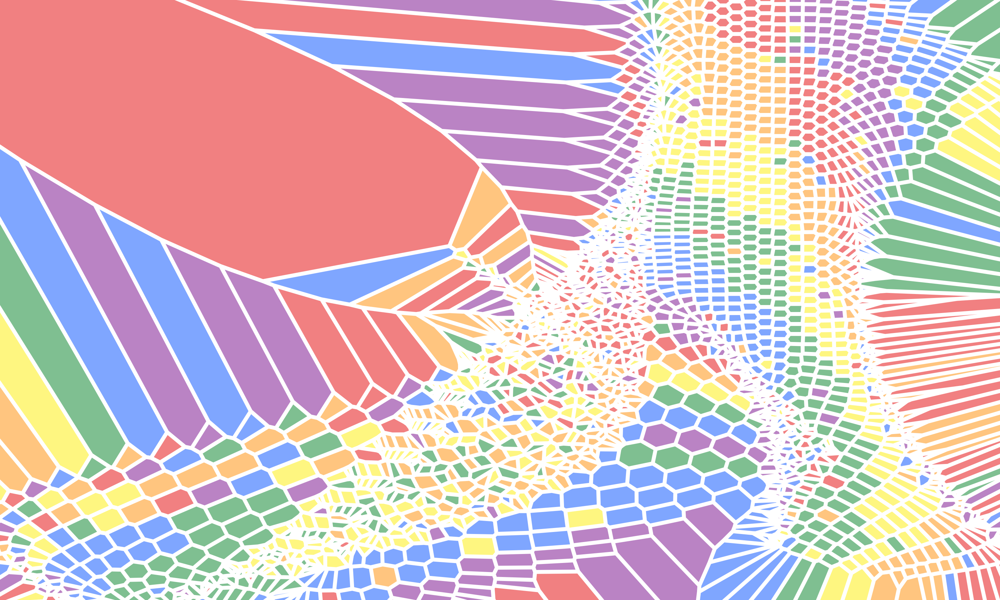

# Explorations of generative art with R

## My work

### Flows (inspired by Danielle Navarro's *Splatter*)

[**GALLERY**](flows); [code](https://github.com/tinarozsos/art/code/flows.R)

### Lines (inspired by Ijeamaka Anyene's *Radial patterns*)

[**GALLERY**](lines); [code](https://github.com/tinarozsos/art/code/lines.R)

### Watercolor-like blobs (inspired by Tyler Hobbs's *Watercolors*)

[**GALLERY**](watercolor); [code](https://github.com/tinarozsos/art/code/watercolor.R)

### Pride flag art

[**GALLERY**](pride); [code](https://github.com/tinarozsos/art/code/pride.R)

## Inspiration

* Danielle Navarro: [blog](https://blog.djnavarro.net/), [gallery](https://art.djnavarro.net/gallery/)
* Antonio Sánchez Chinchón: [blog](https://fronkonstin.com/)
* Thomas Lin Pedersen: [gallery](https://thomaslinpedersen.art/work/#category=)
* Nicola Rennie: [gallery](https://nrennie.rbind.io/portfolio/rtistry/)
* Claus O. Wilke: [probabilistic colors](https://clauswilke.com/art/post/coloring-ggplot2)
* Ijeamaka Anyene: [radial patterns examples](https://ijeamaka.art/portfolio/radial_patterns/)
* Tyler Hobbs: [watercolors](https://tylerxhobbs.com/essays/2017/a-generative-approach-to-simulating-watercolor-paints)